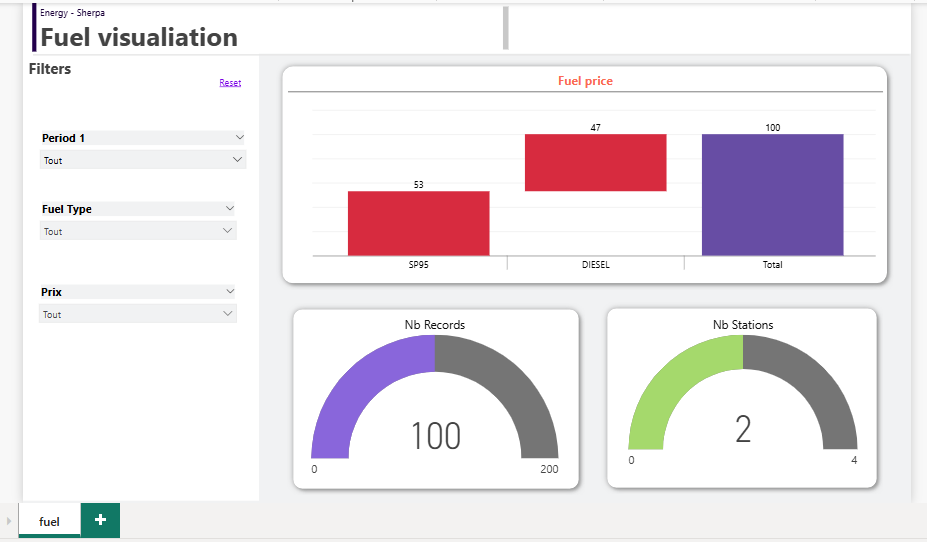
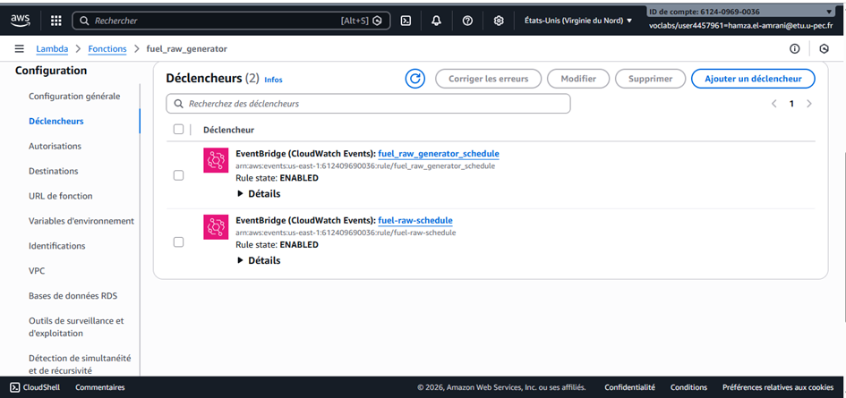

# Fuel Data Pipeline (AWS) — Demo-ready

## Objectif
Pipeline automatisé:
1) Ingestion des prix carburants via API officielle
2) Stockage RAW dans S3
3) Transformation Glue -> CURATED (Parquet)
4) Catalogue + requêtes Athena
5) Export CSV pour Power BI

Source dataset (flux instantané v2): data.economie.gouv.fr

---

## Architecture
EventBridge (schedule) -> Lambda (download API -> S3 raw -> start Glue)
Glue Job -> S3 curated (parquet)
Glue Crawler -> Table Athena
Athena -> Export CSV -> Power BI

---

## Pré-requis (valeurs)
- Bucket S3: fuel-pipeline-hamza-8421
- Glue job: fuel_ingest
- Lambda env vars:
  - BUCKET=fuel-pipeline-hamza-8421
  - GLUE_JOB_NAME=fuel_ingest
  - SOURCE_API_URL=https://data.economie.gouv.fr/api/explore/v2.1/catalog/datasets/prix-des-carburants-en-france-flux-instantane-v2/records?limit=1000

---

## Démo (checklist)
1) Déclencher Lambda (Test)
2) Vérifier S3: raw/fuel/ingestion_date=YYYY-MM-DD/...
3) Vérifier Glue: job run succeeded
4) Vérifier S3: curated/fuel/ (parquet)
5) Athena: SELECT * FROM curated LIMIT 100
6) Export CSV -> importer dans Power BI

## Screenshots (preuves)

### 1) S3 / Dossiers

### 2) S3 / RAW

### 3) S3 / CURATED

### 4) Glue Job

### 5) Glue Run (Succeeded)

### 6) Lambda

### 7) EventBridge Trigger

### 8) Athena Query

### 9) Athena Results

### 9) schema generale 
