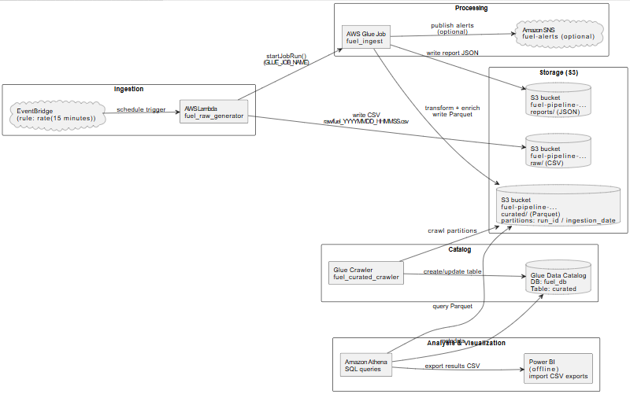
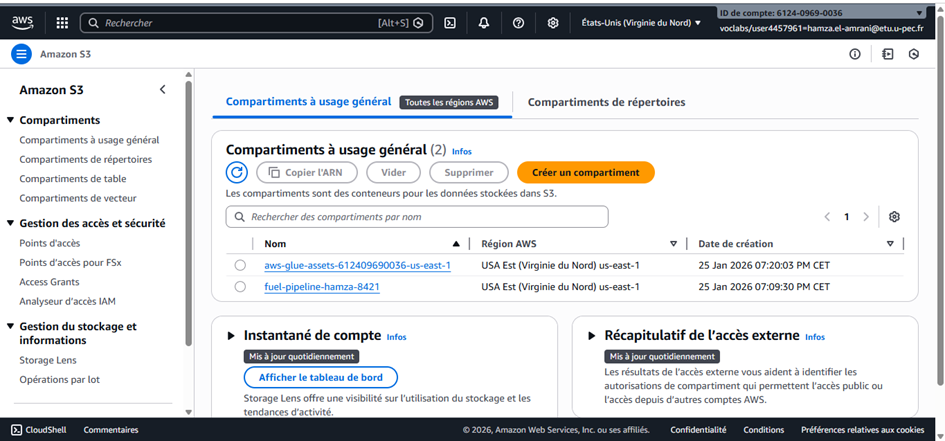
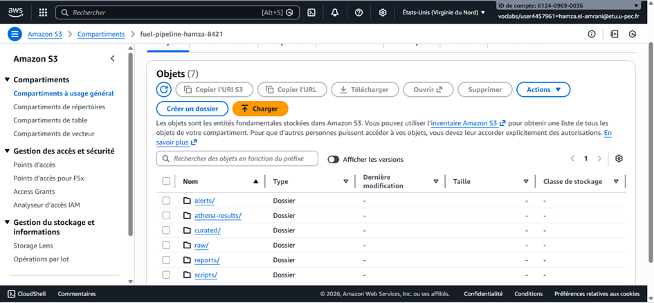
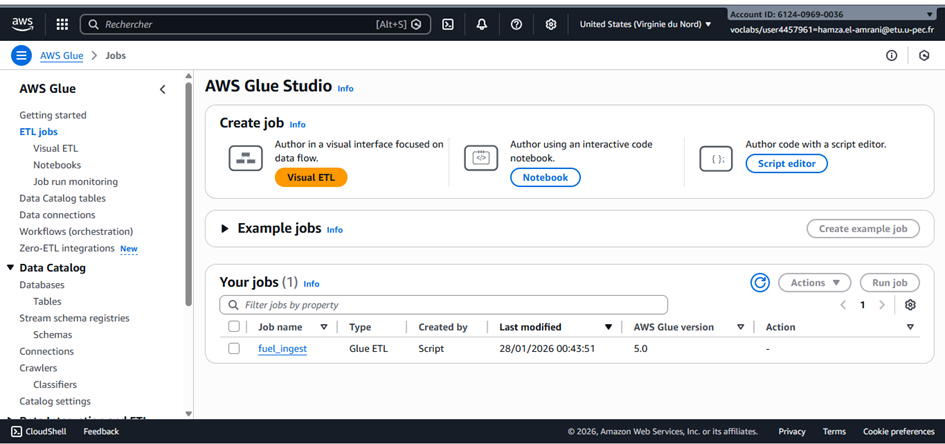
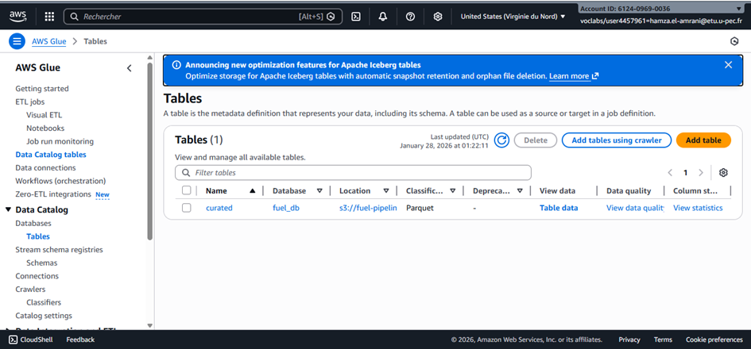
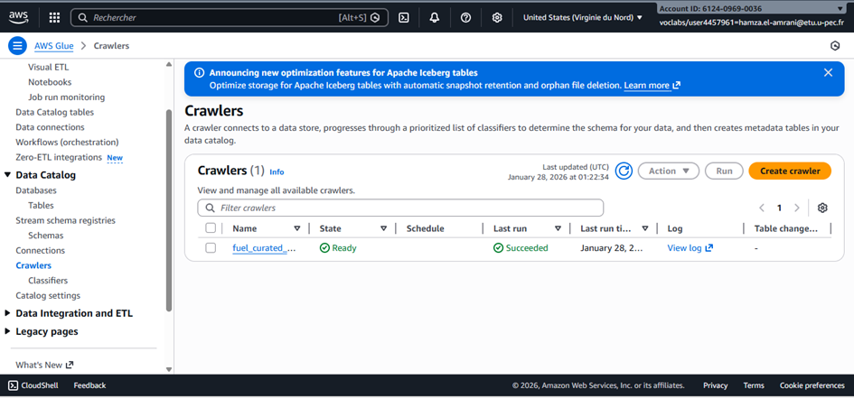
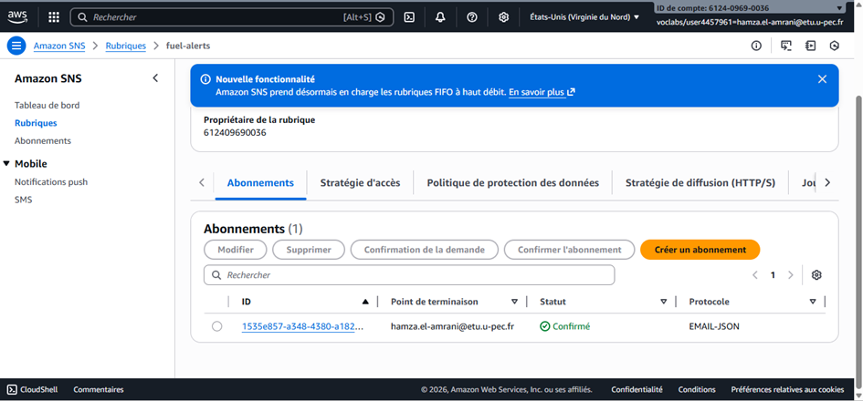
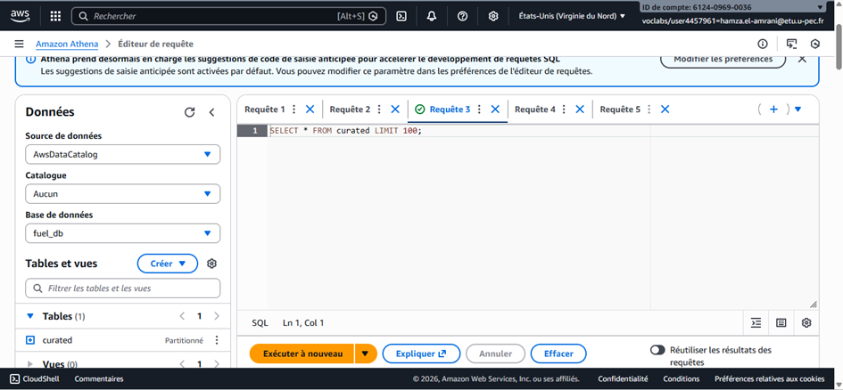

# Fuel Data Pipeline (AWS) — Demo-ready
# Fuel Data Pipeline (AWS) — Demo-ready

## Contexte métier (client + besoin)
Un client (réseau de stations / équipe pricing / service mobilité) veut **surveiller les prix des carburants** (SP95, DIESEL, etc.) pour :
- suivre l’évolution des prix dans le temps,
- comparer les prix entre stations,
- produire des KPI (prix moyen, min/max, tendances),
- alimenter un dashboard **Power BI**.

**But du PoC** : prouver qu’on peut construire un pipeline Cloud automatisé de bout en bout : ingestion → stockage → transformation → analyse → export BI.

---

## Les 5V (Big Data) appliqués au projet
- **Volume** : flux de nombreux enregistrements (stations, types, dates) + historique qui grandit à chaque exécution.
- **Vélocité** : données mises à jour fréquemment (pipeline planifié via EventBridge).
- **Variété** : champs hétérogènes (station_id, fuel_type, price, date, localisation…) + formats RAW (CSV) et CURATED (Parquet).
- **Véracité** : besoin de contrôles qualité (typage, valeurs manquantes, doublons, normalisation).
- **Valeur** : création d’indicateurs utiles (moyennes, comparaisons, alertes potentielles) et visualisation Power BI.

---

## Cas d’usage fonctionnel (ce que l’utilisateur final obtient)
1) Le pipeline récupère automatiquement les prix via l’API officielle.
2) Les données brutes sont stockées en S3 (traçabilité).
3) Les données sont transformées en Parquet (plus rapide/moins cher à requêter).
4) Athena permet d’interroger en SQL.
5) Les résultats sont exportés en CSV et visualisés dans Power BI (graphiques + DAX).

---

## Objectif
Pipeline automatisé :
1) Ingestion des prix carburants via API officielle  
2) Stockage **RAW** dans S3  
3) Transformation **Glue → CURATED (Parquet)**  
4) Catalogue + requêtes **Athena**  
5) Export **CSV** pour **Power BI**

**Source dataset (flux instantané v2)** : data.economie.gouv.fr

---

## Architecture (résumé)
EventBridge (schedule) → Lambda (download API → S3 raw → start Glue)  
Glue Job → S3 curated (Parquet)  
Glue Crawler → Table Athena (Glue Data Catalog)  
Athena → Export CSV → Power BI

---

## Pré-requis (valeurs)
- **Bucket S3** : `fuel-pipeline-hamza-8421`
- **Glue job** : `fuel_ingest`
- **Database Glue** : `fuel_db`
- **Table Athena** : `curated`

### Lambda env vars
- `BUCKET=fuel-pipeline-hamza-8421`
- `GLUE_JOB_NAME=fuel_ingest`
- `SOURCE_API_URL=https://data.economie.gouv.fr/api/explore/v2.1/catalog/datasets/prix-des-carburants-en-france-flux-instantane-v2/records?limit=1000`

---

## Démo (checklist)
1) Déclencher Lambda (Test) **ou** attendre EventBridge (schedule)
2) Vérifier S3 : `raw/` → un nouveau fichier apparaît
3) Vérifier Glue : job run **Succeeded**
4) Vérifier S3 : `curated/` → fichiers **.parquet**
5) Athena : `SELECT * FROM curated LIMIT 100;`
6) Export CSV → importer dans **Power BI**

## Screenshots (preuves)

### 9) schema generale 

### 1)  

### 2) 

### 3) 

### 4) 

### 5) 

### 6) 

### 7) 

### 8) 

